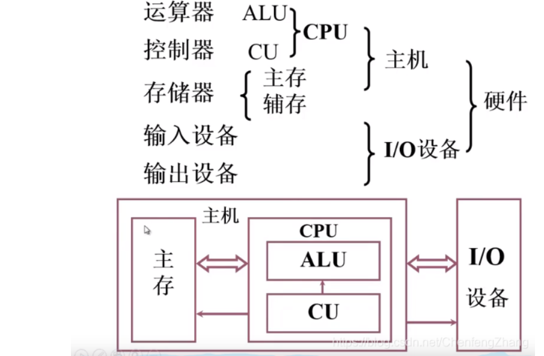

# 计算机工作步骤与存储器基本组成

### 计算机工作步骤 

* 建立数学模型
* 确定计算方法
* 指定解题程序

### 基本概念

* 程序：运算的所有步骤
* 指令：每一个步骤
* 指令格式：操作步骤（6）+ 地址码（10）

### 存储器的基本组成

| title | idea |
| :--- | :--- |
| MAR | 存储器地址寄存器，反映存储单元的个数 |
| MDR | 存储器数据寄存器，反映存储字长 |

### 

### 引用

> [https://blog.csdn.net/ChenfengZhang/article/details/107972666?spm=1001.2014.3001.5501](https://blog.csdn.net/ChenfengZhang/article/details/107972666?spm=1001.2014.3001.5501)
>
> [https://zhuanlan.zhihu.com/p/115007548](https://zhuanlan.zhihu.com/p/115007548)

